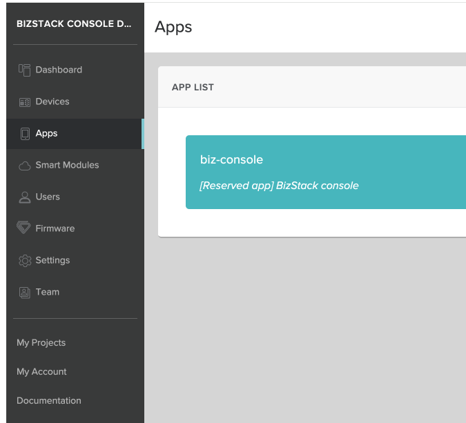
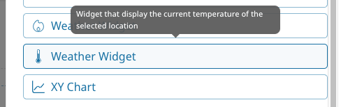
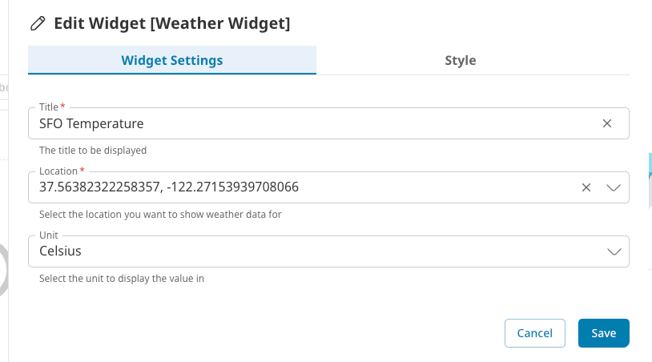
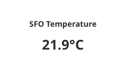

# BizStack Console Plugin Template
This document contains instruction on how to create plugins for BizStack Console. This directory also contain templates for different types of
Plugin.

Please also read [BizStack Console Developer Manual](https://console.bizstack.cloud/documentation/developer-manual/index).

## Requirements
Because `@moderepo/bizstack-console-sdk` package is published to [GitHub Packages](https://github.com/moderepo/bizstack-console/pkgs/npm/bizstack-console-sdk), not NPM, you will need to create an Access Token from GitHub and log into
npm with that token.
- Create a personal access token (classic) here https://github.com/settings/tokens. Since you only need permission to install `@moderepo/bizstack-console-sdk` in your
project, you will only need `read:packages` access. (NOTE: GitHub Packages only supports authentication using the classic token.)
- Then login into npm and tell it which registry you want it to use to find packages with this command
    ```
    $ npm login --registry=https://npm.pkg.github.com
    > Username: USERNAME
    > Password: TOKEN
    > Email: PUBLIC-EMAIL-ADDRESS
    ```
    USERNAME is your GitHub username and use the token you generated as password. For more information see https://help.github.com/en/packages/using-github-packages-with-your-projects-ecosystem/configuring-npm-for-use-with-github-packages

## Create a project for the plugin using Vite

We use [Vite](https://vite.dev/) for building the project.  We use its module federation plugin.

### Create a new project
- Run `npx create-vite my_widget`
- Choose `React` (Other frameworks are not supported yet)
- Choose `Typescript`

> [!CAUTION]
> As of November 2024, we only support React in the plugin system. Other frameworks are not supported yet.

### Create a `.npmrc`
Create a new `.npmrc` file in your project, or edit your `~/.npmrc` file to include the following line.

```
@moderepo:registry=https://npm.pkg.github.com/moderepo
registry=https://registry.npmjs.org
```

### Install required libraries
> [!IMPORTANT]  
> For security reasons, please run `npm install` with `--ignore-scripts` option to prevent execution of any script.
- Run `npm i --ignore-scripts -D @moderepo/bizstack-console-sdk` to install `@moderepo/bizstack-console-sdk`
- Run `npm i --ignore-scripts -D @originjs/vite-plugin-federation` to install Module Federation plugin for Vite since we are using Vite instead of Webpack
- Run `npm i --ignore-scripts zustand` to install Zustand.
- Install Material UI v5
  - This step is only required if the plugin needs to use MUI. Technically, the plugin can use any CSS library. However, to have the
    plugin UI integrate smoothly with BizStack Console, it is recommended that the plugin also use MUI v5. To install MUI, please follow the instruction
    [here](https://v5.mui.com/material-ui/getting-started/installation/). Note that MUI recommend using @emotion style engine. However, if
    you want to use styled-component, please follow the instruction on how to use styled-component style engine. Also, using styled-component
    style engine will require additional setup. Please look at the example plugin's `tsconfig.json` and `vite.config.ts` for example.
- Install other libraries as needed e.g. eslint, prettier, etc...

> [!CAUTION]
> As of November 2024, please install MUI v5. MUI v6 is not supported yet.
> `npm install --ignore-scripts @mui/material@5 @mui/styled-engine-sc@5 styled-components@5`
> `npm i --ignore-scripts -D @types/styled-components`

### Delete unnecessary files (Optional)
Because we use Vite to create a new React project, it will automatically create a simple app with a welcome page. Since this is a Plugin
project, we don't need most of these files therefore we can clean up by deleting them. These are some of the files that can be deleted. Note
that this step is optional.
- src/App.tsx
- src/App.css
- src/index.css
- src/main.tsx
- src/vite-env.d.ts
- index.html (You might need to create a blank index.html to get around a compile error because of missing index.html)

## Configure the project
### Update `vite.config.ts`
- Configure the port number to use. This is optional but it is easier to test the plugin if we use a specific port so that we don't need to
update the config every time the port number change. In this example, we will use port 5000 but any unused port number works.

  ```
    export default defineConfig({
        server: {
            port: 5000,
        },
        preview: {
            port: 5000,
        },
        plugins: [...]
    }
  ```

- Configure the `build` option
  ```
    export default defineConfig({
        ...,
        build: {
            // This is important. It tells the compiler to generate the Javascript code that use the latest Javascript features
            target: 'esnext',

            // This is important. This will make the compiler not generate the style file. Having the style file
            // loaded with the module will break BizStack Console's style
            cssCodeSplit: true,

            minify: true,
        },
    })
  ```

- Configure the Module Federation plugin. We will use one of the plugins for example. You will need to modify this config accordingly
based on the plugin that you are building.
  ```
    // at the beginning of vite.config.ts
    import federation from '@originjs/vite-plugin-federation'
  
    export default defineConfig({
        ...,
        plugins: [
            react(),
            federation({
                name: 'Weather Widget',

                // The plugin entry file name of the file to be generated by the build script
                filename: 'weatherWidget.js',

                // Modules to expose
                exposes: {
                    './weatherWidget': './src/weather-widget/WeatherWidget',
                },

                shared: ['react', 'react-dom', '@mui/material', 'zustand', '@moderepo/bizstack-console-sdk']
            })
        ],
        ...
    })
  ```

- Configure the resolve settings (This is only needed if MUI and styled-component is used)
  ```
    export default defineConfig({
        ...
        resolve: {
            alias: {
                // Because we use styled-component instead of Emotion, we need to tell the complier where to find the styled engine
                // when there is an import at '@mui/styled-engine'
                '@mui/styled-engine': '@mui/styled-engine-sc',
            },
        },
        ...
    })
  ```

  ## Implement the plugin
  - Create a directory under the `src` directory where all the files for the plugin will be stored. This is not needed but doing this will keep
  the code clean if the `src` directory have other files. So based on the example we used in the previous section, we will create a directory
  name `weather-widget`.
  
  ### Create files for the plugin
  What files you need to create will depend on the type of widget you are creating. Technically, you can put everything into 1 file but it would
  be cleaner to separate the files. Below is the recommendation but you don't need to do exactly the same

  #### Files for Dashboard Widget plugins
  - `utils.ts`
    This file is where we place all util/helper functions, constants, etc...
  - `models.ts`
    This file is where we place the models for the widget e.g. the widget's customSettings mode and other models that the widget needs.
  - `schema.ts`
    This file is where we define the setting schema to be used for creating the widget's settings UI.
  - `[ComponentName].tsx`
    This is where the component/widget code should be placed.
  - `styled.tsx`
    This is where we place the styled components to style the widget

  #### Files for Component plugins
  The same as dashboard widget plugins

  #### File that ALL plugins package should have.
  - `config.ts`
    This file is the most important file. It is the entry point to the plugins and will be loaded by BizStack Console. This file is where we place
    the configuration for the plugins. In this file, there must be a variable called `bizConsolePlugins` and it must be an Object. Inside this
    object must contain an Array of plugins definition. The array can contain 1 or more plug in definitions and the definitions can be for
    different types of plugins. This allows 1 plugin package to implement multiple plugins.

## Test the plugin
### Host the plugin locally
- Run `npm run build` to build the plugin. This will generate Javascript files under the `/dist/assets` directory.
- Run `npm run preview` to run a web server where the plugin will be hosted LOCALLY. Now the plugin's code should be accessible at this URL
http://localhost:5000/assets/weatherWidget.js based on the configuration we use in this doc. Change this URL accordingly based on your config. 

### Configure project's app config
- Go to DEV console on one of the environment that you need to use (DEV, STAGE, or PROD). And then go to the project you want to add the plugin to
  
- Go to the `Apps` settings and select `biz-console`
- Edit the `CUSTOM CONFIGURATION OBJECT`. Enter this JSON.
  ```
    {
        ..., // other app settings e.g. Drawer menu, translation, etc...

        "plugins": [
            {
                // The name of the plugin. This is used by Module Federation to manage the remote modules.
                "name": "WeatherWidget",

                // This tells BizStack Console where to download the plugin. Since we are testing it locally, the URL will be
                // http://localhost.
                "url": "http://localhost:5000/assets/weatherWidget.js",

                // This tells BizStack Console the name of the module to look for. This name is the same name as the one specified in the
                // vite.config.ts's `exposes`
                "exposedModuleName": "weatherWidget"
            },

            // Do the same for Page/Component plugins
            {
                "name": "MyComponent",
                "url": "http://localhost:5001/assets/myComponent.js",
                "exposedModuleName": "myComponent"
            }
        ],
    }
  ```

  ### Try using the plugin in BizStack Console
  #### For Widget Plugins
  When BizStack Console loads Widget Plugins, it will automatically add the widgets defined in the plugins' `config.ts` to the BizStack Console
  widgets collection. The user will see these widgets right away in the Add Widget screen. No additional configuration required.

  - Go to BizStack Console and go to any dashboard. And then go into Edit dashboard mode.
  - Click on `Add Widget` and you will see the new widget appear in the list of widgets. NOTE that only you can see the widget because this
  is running locally on your computer. Other users will not see the widget.
    
  - Configure the widget
    
  - Check out the widget on the dashboard and verify if everything look good
    

  #### For Page/Component Plugins
  Similar to Widget plugins, BizStack Console will add all the components defined in the plugin's `config.ts` to the BizStack Console's components
  collection. All components stored in the BizStack Console components collection can be used for building custom pages. However unlike Dashboard,
  there is no UI to build custom pages. Therefore, to create custom pages and configuring the components to be added to the pages will
  require editing the Project App config directly, the same place where we define the `plugins` config.
- Go to DEV console on one of the environment that you need to use (DEV, STAGE, or PROD). And then go to the project you want to add the custom
  pages to
- Go to the `Apps` settings and select `biz-console`
- Edit the `CUSTOM CONFIGURATION OBJECT`. Enter this JSON.
  ```
    {
        ..., // other app settings e.g. Drawer menu, translation, etc...

        // This is the plugins config mentioned in the previous section
        "plugins": [
            ...
        ],

        // This is the config for the custom pages. Each custom page will require a customRoute settings.
        "customRoutes": [

            // This is an example page 1. More detailed explanation below.
            {
                "path": "my_custom_page",
                "pageSettings": {
                    "pageType": "custom",

                    // The configuration for 1 component to be added to the page
                    "componentSettings": {
                        "componentType": "MyPageComponent",
                        "customProps": {
                            "projectId": 1234,
                            "entityId": "xyz"
                        }
                    }
                }
            },
            
            // This is an example page 2. More detailed explanation below.
            {
                "path": "my_custom_page_2/:entityId",
                "pageSettings": {
                    "pageType": "generic",

                    // The title/subtitle to be added to the top of the page
                    "title": "My Custom Page",
                    "subtitle": "...",

                    // Other components to be added to the top bar e.g. Breadcrumb bar, buttons, etc...
                    "topActionBarSettings": {
                        "leftComponentsSettings": [],
                        "rightComponentsSettings": [],
                    }

                    // The configuration for 1 or more components to be added to the page
                    "componentsSettings": [
                        "componentSettings": {
                            "componentType": "MyComponent1",
                            "customProps": {
                                "pageSize": 5,
                                "backgroundColor": "#00ff00"
                            },
                            "dynamicProps": [
                                {
                                    "name": "projectId",
                                    "required": true,
                                    "source": "state"
                                },
                                {
                                    "name": "entityId",
                                    "type": "number",
                                    "required": true,
                                    "source": "route"
                                },
                                {
                                    "name": "startTime",
                                    "type": "number",
                                    "required": false,
                                    "source": "search"
                                }
                            ]
                        },
                        "gridSizes": {
                            "lg" : 6,
                            "md" 12
                        }
                    }, {
                        "componentSettings": {
                            "componentType": "MyComponent2",
                            "customProps": {
                                ...
                            },
                            "dynamicProps": {
                                ...
                            }
                        },
                        "gridSizes": {
                            "lg" : 6,
                            "md" 12
                        }
                    }],
                }
            }
        ]
    }
  ```
    - `path` - The relative route path of the custom page. All custom pages will start from this route
      http://bizconsole.domain/projects/1234/custom/ and followed by the `path` of the route. For example, if the `path` is set to
      `my_custom_page` then the full path for this page is at http://bizconsole.domain/projects/1234/custom/my_custom_page

      Note, `path` doesn't have to be just a simple string, it can be something like this `employees/list` which means the full URL will be
      http://bizconsole.domain/projects/1234/custom/employees/list.
      
      Also, `path` can contain route params e.g. `my_custom_page_2/:entityId`. This means the full URL will be like this
      http://bizconsole.domain/projects/1234/custom/my_custom_page_2/ and anything after that will be converted to `entityId` value. The component
      can then use this `entityId` value and do what it needs to do. So, if the URL is like this
      http://bizconsole.domain/projects/1234/custom/my_custom_page_2/abc then `entityId` will be `abc`.

    - `pageSettings` - The object that contain the configuration for the page. This config contains information about what component/s to add
      to the page and how the components should be laid out. There are 2 types of page settings that BizStack Console supports.
      - `custom` - This is a type of page which the developer is in control of the entire page. The developer will need to implement the
      page layout, handle adding the breadcrumb bar and tabs to the top section if the page needs to show breadcrumbs and tabs, and implement
      the entire content of the page. BizStack Console will create and display the component specified in the `componentSettings` on the page and
      that is all it does. The content of the page will be up to the implementation of the component. So based on the example 1 above, the
      component `MyPageComponent` will be the only component to be added to the page and the params `projectId` with value 1234 and `entityId` with
      value `xyz` will be passed to the component. Custom pages can have `customProps` and `dynamicProps` and more explanation on what the
      differences are will be provided in the next section.

      - `generic` - This is a type of page that wants to use the same layout that most BizStack Console pages use. Most of BizStack Console pages are pages
      that contain 1 or more components and use the Grid layout to lay out the components. The `Account Settings` page is a good example of
      this layout. This page contains 5 components, `Personal Info`, `Password`, `Two-Factor Authentication`, `Member Of`, and `Permissions`
      components and they are laid out using the Grid layout. All the other pages in BizStack Console are also using the Grid layout to lay out the
      components but they are just not obvious because most of them have only 1 component. Therefore, if a project wants to create a custom page
      that has 1 or more components to display and wants to use the same layout as all BizStack Console pages, they can use the `generic` pageType
      as shown in the example 2 config.
      Generic page type's settings has a few more options than `custom` page type.
        - `title` and `subtitle` - These are optional title and subtitle that the admin can add to the page. Similar to other BizStack Console page,
        the title and subtitle will be added to the top of the page.
        - `topActionBarSettings` - These are optional settings that allow the admin to add other components to the top action bar which are
        usually used for displaying breadcrumb bars. However, this bar is not restricted to breadcrumb bars. The admin can add any component
        to this bar as they like e.g. buttons. It is recommended that the admin use this area to display small components.
        - `componentsSettings` - Similar to the `custom` page type, the admin will need to provide the component/s to be displayed in the page.
        However, unlike the `custom` page type, `generic` page type allows the admin to add more than 1 component. And for each component, the
        admin can configure the component's layout such as how many columns in the grid the component uses for different screen sizes.

      In summary, whether to use `custom` or `generic` page type depends on the use cases. It is recommended to use `generic` page type
      if possible because the page layout is set. The page's title/subtitle, top action bar, the component's layout are defined. The admin only need
      to provide the information/components to be displayed in those areas. This will make sure the custom pages and BizStack Console built-in pages
      look the same. Also, if BizStack Console changes the page layout design, the developers don't need to update the plugins and the admin don't need
      to update the `customRoutes` config. All the custom pages will automatically be updated to use the new design. `custom` page type should
      be used when the admin wants the page to have its own layout.

        - `componentSettings` - Both `custom` and `generic` page type require component settings which specify what component/s to add to the page.
        `custom` page type requires the settings for only 1 component which will use as the entire page. `generic` page types allow the admin to
        add more than 1 component to the page. The settings object for both of these page types are the same.
          - `componentType` - The type name of the component to create/add to the page. This should be the value of the `type` attribute
          of the plugin config defined in `config.ts` file.
          - `customProps` - The prop values to be passed to the component. Components usually have props so that the component can be customized.
          For example, let's say a developer created a component that displays a user's info. Most likely this component will accept a prop name
          `userId` which the user of this component need to provide in order for the component to display the user info of that user. It doesn't
          make sense for the component to hardcode the userId and display the user info of 1 specific user. Therefore, `userId` would probably
          be one of the props that this component requires. Example of other props that the component might also accept are `title` to allow the
          admin to add a title to the component. `hideEmail` for example to allow the admin to have the component hide the user's email, etc...
          It is up to the component developer to decide what require/optional props the component accepts to make the component customizable
          and reusable. And the admin can pass the values for these props through the `customProps` settings. For example
          ```
          "componentSettings": {
              "componentType": "UserInfo",
              "customProps": {
                  "userId": 1234,
                  "hideEmail": true
              }
          }
          ```
          - `dynamicProps` - A way for the admin to pass prop values to the component that are not known at settings time. Some prop values
          to be passed to the component are not known at settings time. A good example of this is the `userId` prop in the previous example.
          The previous example shows that the admin can set value `1234` for the `userId` props in the config so that the component can display
          user info for the user with ID `1234`. This actually doesn't make sense either because this means this component will always show
          user info for this user ID `1234`. This is almost like having the component hardcode the userId in the code. For this case,
          `userId` should probably come from some source dynamically at runtime. This is what the `dynamicProps` are used for. It allows the
          admin to configure the props to be passed to the component which the values will be determined at runtime.
          `dynamicProps` is an ARRAY of objects, 1 for each prop. This object can have the following attribute depending on where the value
          of the prop come from
            - `source` - To specify where the value of the prop comes from. The value can be `route` if the value of this prop comes from the
            route param. For example, if the route path is like this `my_custom_page/:userId`, it means the `userId` will be a route param.
            And if the admin wants to use this route param value as the value for the `userId` prop to be passed to the component, they can
            use the `route` source type.
            Source can also be `search` which mean the value for this prop comes from the URL search param. For example, if the URL of the
            page is like this http://bizconsole.domain/projects/1111/custom/my_custom_page?userId=1234 then the `userId` will be a search
            param source.
            And the other source type is `state` which the value for the prop comes from the BizStack Console states.
            - `type` - The type of the source value. If source is `route` or `search`, BizStack Console doesn't know what the type of the value is.
            For example, http://bizconsole.domain/projects/1111/custom/my_custom_page?entityId=1234. The value of the `entityId` param is `1234`. It
            looks like a number but it might not be what the case. `entityId` are strings but the user who create the entity can give it a value
            `1234` as ID. So if the component expects an `entityId`, it probably needs a `string` value. Therefore, the admin needs to tell
            BizStack Console how to treat the value of this `entityId` param because only the admin knows what value type the component needs. So in
            this case, the admin should set `type` to `string` so that BizStack Console can use the value `1234` as string and pass it to the component
            as a string, not a number. Other types that are supported are `number`, `boolean`, `string_array`, `number_array`, and `boolean_array`.
            - `name` - The name of the props to look for from the source. For this example, `my_custom_page/:userId`, the `source` is `route` and
            `name` should be `userId`. For this example, http://bizconsole.domain/projects/1111/custom/my_custom_page?entityId=1234, the `source`
            should be `search` and the `name` should be `entityId`.
            - `required` - To specify whether or not the prop is required. If this is set to `false`, then BizStack Console will NOT throw error if the
            value for the prop is not found. If set to `true` then BizStack Console will throw an error if it is unable to find the prop value from
            the source that the admin specified.
            - `componentPropName` - For the case when the source's prop name is not the same as the component's prop name. Let's say the UserInfo
            component expect a prop name `userId` but the source param uses a different name. For example, let's say the URL is like this
            http://bizconsole.domain/projects/1111/custom/my_custom_page?employeeId=1234 and we want the UserInfo component to display
            the user info of the user with ID 1234. For this case, the `name` needs to be set to `employeeId` but the `componentPropName`
            needs to be `userId`.
            Here are some `dynamicProps` settings examples
            ```
            // For example: http://bizconsole.domain/projects/1234/custom/employees?employeeId=123456
            "componentSettings": {
                "componentType": "UserInfo",
                "customProps": {
                    "hideEmail": true  // This is static prop so it is OK to be set in the "customProps"
                },
                "dynamicProps": [{
                    "source": "state",
                    "name": "projectId" // "projectId" and "loggedInUserId" are the only allowed values from the source "state"
                }, {
                    "source": "search",
                    "name": "employeeId",
                    "type": "number",
                    "componentPropName": "userId"
                }]
            }

            // For example: http://bizconsole.domain/projects/1234/custom/entity_details/abc
            "componentSettings": {
                "componentType": "UserInfo",
                "customProps": {
                    "hideEmail": false
                },
                "dynamicProps": [{
                    "source": "route",
                    "name": "entityId",
                    "type": "string"
                }]
            }

            // For example: http://bizconsole.domain/projects/1234/custom/entity_details/abc?startTime=11111111111&endTime=2222222222
            "componentSettings": {
                "componentType": "UserInfo",
                "customProps": {
                    "hideEmail": false
                },
                "dynamicProps": [{
                    "source": "route",
                    "name": "entityId",
                    "type": "string"
                }, {
                    "source": "search",
                    "name": "startTime",
                    "type": "number"
                }, {
                    "source": "search",
                    "name": "endTime",
                    "type": "number"
                }]
            }
            ```
          In summary, how the admin needs to configure the `dynamicProps` settings will depend on the route settings and how the data are provided
          in the URL.

          IMPORTANT NOTE: A developer can feel that using `dynamicProps` is too complicated and have the component get the values for these
          dynamic props in the component itself. For example, the project knows that the `userId` will be in the route params because the project
          will set up the custom routes like this
          ```
            "customRoutes": [{
                "path": "my_custom_page/:userId",
                "pageSettings": {
                    "pageType": "custom",
                    "componentSettings": {
                        "componentType": "UserInfo",
                        "customProps": {
                            "hideEmail": true
                        },
                        // NO NEED "dynamicProps"
                    }
                }
            }]
          ```

          Therefore, the URL for this route will be like this http://bizconsole.domain/projects/1234/custom/my_custom_page/1111. And the
          developer can create the component like this

          ```
          interface UserInfoProps {
              readonly hideEmail: boolean;

              // DON'T need to provide `userId` as prop.
          }

          const UserInfo:React.FC<UserInfoProps> = ({hideEmail}) => {
              // userId will be in the Route param so get it from the route param
              const routeParams = useParams();
              const userId = routeParams.userId;

              const userInfo = fetchUserInfo(userId);

              // display data in the userInfo object
          }
          ```

          This works and the route config doesn't need the complicated `dynamicProps` settings to get the `userId` from the `route` source type.
          HOWEVER, this will make the `UserInfo` component not reusable in any other places because it assumes the `userId` exist in the
          route param. We can't use this component in a page like this http://bizconsole.domain/projects/1234/custom/my_custom_page?userId=1111.
          For that URL, the `userId` is specified in the `search` param. This is fine if the component is implemented for 1 specific use case
          and there is no plan on reusing it for other places or project. But to have the component reusable, it is recommended that components
          don't try to get prop values itself but get it through the `props` interface. The component should not be aware of where the values
          of its props are from. It only needs to care that the required props values are passed to it from the parent container and use them.
          This is how component should be implemented

          ```
          interface UserInfoProps {
              readonly userId: number;
              readonly hideEmail: boolean;
          }

          const UserInfo:React.FC<UserInfoProps> = ({userId, hideEmail}) => {
              const userInfo = fetchUserInfo(userId);
              // display data in the userInfo object
          }
          ```

          And then the config for component can be like these depending on how the project pass values to the route
          ```
            // If the project uses route params to pass userId to the page
            "customRoutes": [{
                "path": "my_custom_page/:userId",
                "pageSettings": {
                    "pageType": "custom",
                    "componentSettings": {
                        "componentType": "UserInfo",
                        "customProps": {
                            "hideEmail": true
                        },
                        "dynamicProps": [{
                            "source", "route",
                            "type": "number",
                            "name": "userId"
                        }]
                    }
                }
            }]

            // If the project uses search params to pass userId to the page e.g.
            // http://bizconsole.domain/projects/1234/custom/my_custom_page?userId=1111
            "customRoutes": [{
                "path": "my_custom_page",
                "pageSettings": {
                    "pageType": "custom",
                    "componentSettings": {
                        "componentType": "UserInfo",
                        "customProps": {
                            "hideEmail": true
                        },
                        "dynamicProps": [{
                            "source", "search",
                            "type": "number",
                            "name": "userId"
                        }]
                    }
                }
            }]
          ```

            The `UserInfo` component can now can be reused by many other projects which can have different routing setup.


  ### Fix and update the plugin
  If you find any issue with the plugin and need to make changes, go back to the code and make changes.
  During development, it is recommended to use `npm run build:watch` instead of the combination of `npm run build` and `npm run preview`.

  There are quite strong constraints when it comes to reloading during plugin development.
  This is because, due to limitations of the vite-plugin-federation used in the plugin, vite dev mode cannot be used during plugin development.
  As a result, you generally need to run a build every time you make changes.

  However, since manually running `npm run build` each time can hinder smooth development, `npm run build:watch` is provided to monitor file changes.

  ### Deploy the plugin
  When the widget is completed and ready to be used by other, you can deploy everything in the `dist/` directory to some public server. How you
  can do this is up to you. Because the code is static, you can just use any CDN e.g. AWS S3. Once the code is deployed and you have the URL
  to the files, go back to DEV console and update the plugin config. Replace the `url` from http://localhost:5000/assets/weatherWidget.js to
  the URL of the server where you deployed the plugin to.

  ### Verify the widget in BizStack Console
  Because the plugin's entry URL has been changed, you need to go back to BizStack Console to make sure the widget is still working. If you don't see the
  widget anymore, it is probably because the `url` is invalid.
  And since the plugin is now hosted on a public server, other users using this project should also be able to use the widget. You can verify this
  by having someone from another computer access the dashboard.
